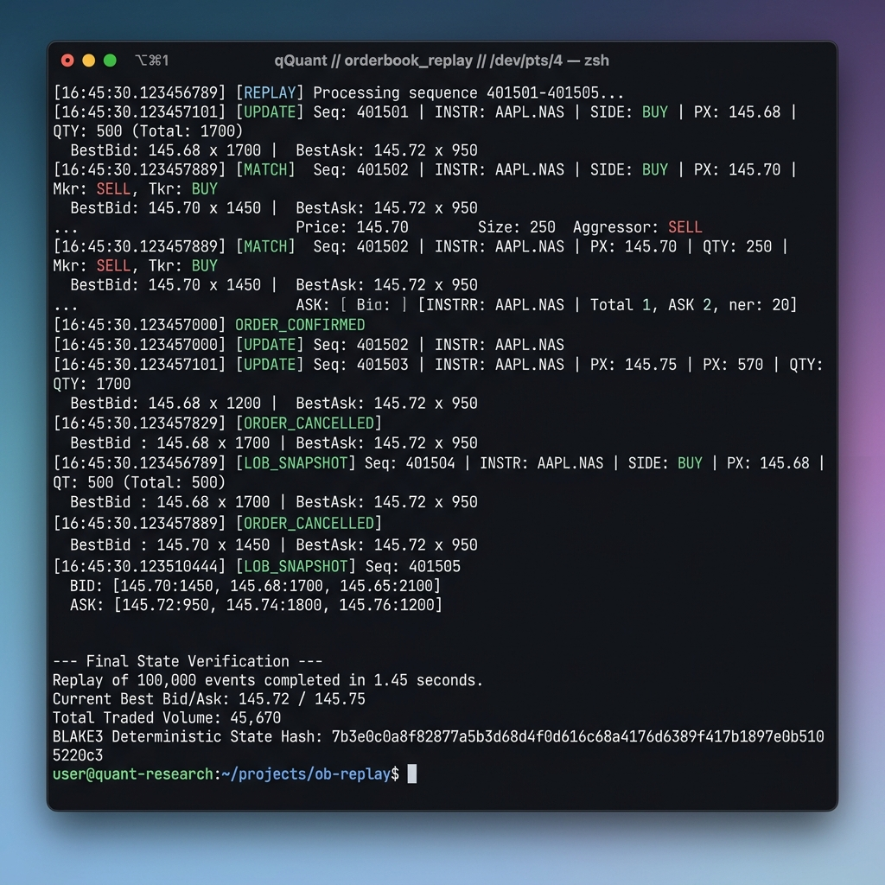
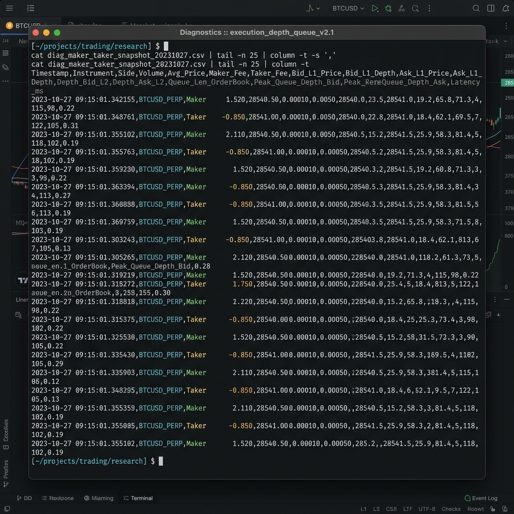
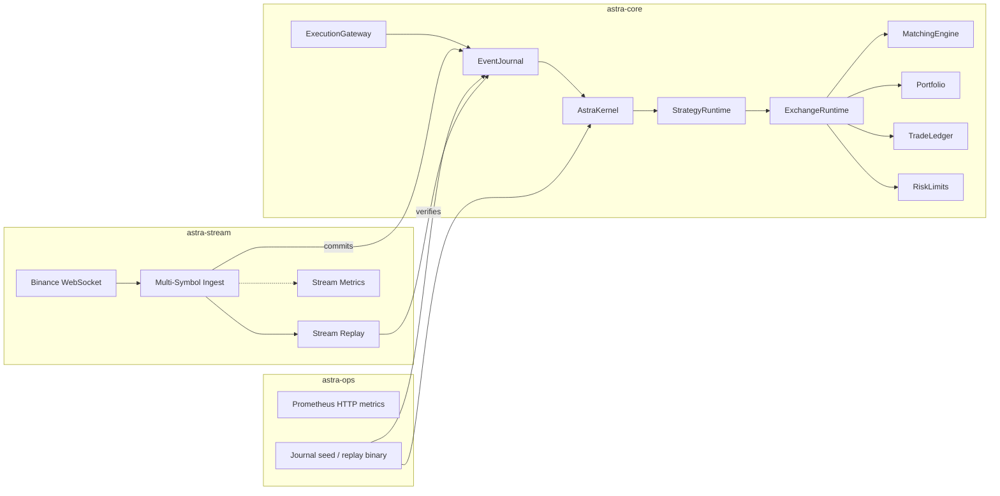

# AstraQuant OS

[](https://github.com/AstraQuantResearch/astraquant-os/actions/workflows/deterministic_ci.yml)

Deterministic, event-sourced trading kernel in Rust — a **research prototype** for replay-safe state machines, not a production exchange stack.

## What this repository is

AstraQuant OS explores how far you can push **operational determinism** in a small trading runtime:

- append-only event journals (`.astra_jl`)
- Blake3 composite state hashes
- canonical bincode serialization
- replay that fails closed on hash mismatch
- a wired exchange reducer: matching engine, portfolio, ledger, risk limits

Use it for systems-engineering portfolios, deterministic-systems demos, and Rust infrastructure interviews — not for live trading without substantial hardening.

## Deterministic Execution Research

AstraQuant is built specifically as research-grade deterministic execution infrastructure. It features a complete `astra-lob` orderbook built completely free of floating-point mathematics, asynchronous runtimes, or network-bound latencies. 

| As-Built Capability | Details |
|---------------------|---------|
| Replay-Safe Matching | Engine guarantees 100% BLAKE3 state-hash identical execution sequences on any machine |
| Deterministic Observability | Institutional engine-clock diagnostics updated exactly during the matching cycle |
| Maker/Taker Tracing | Execution traces are rigorously separated into Maker and Taker execution records |
| Execution Diagnostics | Invariants, queue-depth peaks, and system order metrics extracted offline |
| Snapshot Extraction | BTreeMap queue iteration ensures stable sequence evolution |
| CSV Replay Exports | Output perfectly reproducible trace data without OS-injected timestamps |

### Observatory Trace



## Architecture (as built)



**Deterministic boundary:** `astra-core` has no async runtime. Wall-clock I/O and HTTP metrics live in `astra-ops` and `astra-stream`.

## Deterministic replay

1. Events are appended to `EventJournal` with monotonic `sequence_id`.
2. Reducers implement `EventReducer::apply` and `DeterministicState::state_hash`.
3. `ReplayEngine::replay_journal` rebuilds state from the journal.
4. `replay_and_verify` / `replay_and_verify_from` return `Err` when the recomputed hash differs from the expected hash.

Crash-recovery tests use `SnapshotManager` plus journal tail replay (`tests/journal_tests.rs`).

## Quick start

```bash
cargo test --workspace
cargo run -p astra-ops
```

Environment variables:

| Variable | Default | Purpose |
|----------|---------|---------|
| `ASTRA_JOURNAL_DIR` | `./data/journal` | Journal directory |
| `ASTRA_HTTP_PORT` | `8081` | Prometheus text metrics |

Optional Docker stack: [deploy/README.md](deploy/README.md).

## Crate layout

| Crate | Role |
|-------|------|
| `astra-core` | Deterministic kernel, journal, replay, exchange |
| `astra-stream` | Multi-symbol WebSocket ingest, decimal string parsing, deterministic journal rotation |
| `astra-lob` | Deterministic limit order book, maker/taker semantics, metrics, constraints |
| `astra-ops` | Metrics HTTP, journal seed/replay binary, audit helper |

## Benchmarks

Measured on single-threaded execution without `rayon` or asynchronous networks:

| Benchmark           | Throughput      |
| ------------------- | --------------- |
| Event Processing    | > 10,000 events/sec |
| Snapshot extraction | > 100,000 snapshots/sec |
| CSV export          | > 100,000 rows/sec      |

## Honest limitations

- **Not an HFT production exchange** — Built explicitly for research and replay-safe analytics.
- **No WASM bytecode VM** — sandbox tracks gas and hashes only. It is currently an experimental placeholder.
- **No live exchange connectivity** in the default binary.
- **No Python bindings** — root `pyproject.toml` is not wired to `astra-core`. Python integration is planned but currently inactive.
- **Strategy actions are not auto-journaled** — strategies update internal state; orders must appear as journal events. The strategy system is explicitly a deterministic research prototype.

See [RELEASE_NOTES.md](RELEASE_NOTES.md) and [CONTRIBUTING.md](CONTRIBUTING.md).

## License

MIT — see [LICENSE](LICENSE).