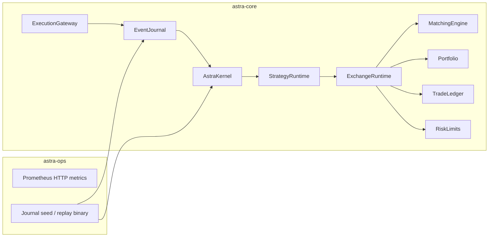

# AstraQuant OS

[](https://github.com/YOUR_ORG/astraquant-os/actions/workflows/deterministic_ci.yml)

Deterministic, event-sourced trading kernel in Rust — a **research prototype** for replay-safe state machines, not a production exchange stack.

## What this repository is

AstraQuant OS explores how far you can push **operational determinism** in a small trading runtime:

- append-only event journals (`.astra_jl`)
- Blake3 composite state hashes
- canonical bincode serialization
- replay that fails closed on hash mismatch
- a wired exchange reducer: matching engine, portfolio, ledger, risk limits

Use it for systems-engineering portfolios, deterministic-systems demos, and Rust infrastructure interviews — not for live trading without substantial hardening.

## Architecture (as built)



**Deterministic boundary:** `astra-core` has no async runtime. Wall-clock I/O and HTTP metrics live in `astra-ops`.

## Deterministic replay

1. Events are appended to `EventJournal` with monotonic `sequence_id`.
2. Reducers implement `EventReducer::apply` and `DeterministicState::state_hash`.
3. `ReplayEngine::replay_journal` rebuilds state from the journal.
4. `replay_and_verify` / `replay_and_verify_from` return `Err` when the recomputed hash differs from the expected hash.

Crash-recovery tests use `SnapshotManager` plus journal tail replay (`tests/journal_tests.rs`).

## Quick start

```bash
cargo test --workspace
cargo run -p astra-ops
```

Environment variables:

| Variable | Default | Purpose |
|----------|---------|---------|
| `ASTRA_JOURNAL_DIR` | `./data/journal` | Journal directory |
| `ASTRA_HTTP_PORT` | `8081` | Prometheus text metrics |

Optional Docker stack: [deploy/README.md](deploy/README.md).

## Crate layout

| Crate | Role |
|-------|------|
| `astra-core` | Deterministic kernel, journal, replay, exchange |
| `astra-ops` | Metrics HTTP, journal seed/replay binary, audit helper |

## Honest limitations

- **No WASM bytecode VM** — sandbox tracks gas and hashes only.
- **No live exchange connectivity** in the default binary.
- **No distributed consensus** — cluster tests are in-process only.
- **No Python bindings** — root `pyproject.toml` is not wired to `astra-core`.
- **Strategy actions are not auto-journaled** — strategies update internal state; orders must appear as journal events.

See [RELEASE_NOTES.md](RELEASE_NOTES.md) and [CONTRIBUTING.md](CONTRIBUTING.md).

## License

MIT — see [LICENSE](LICENSE).