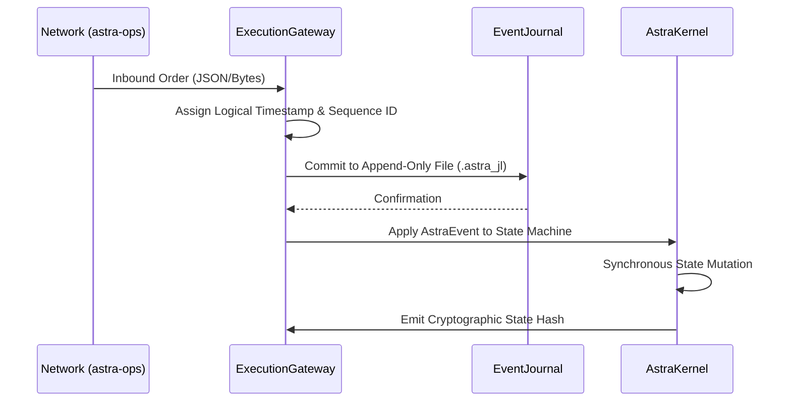
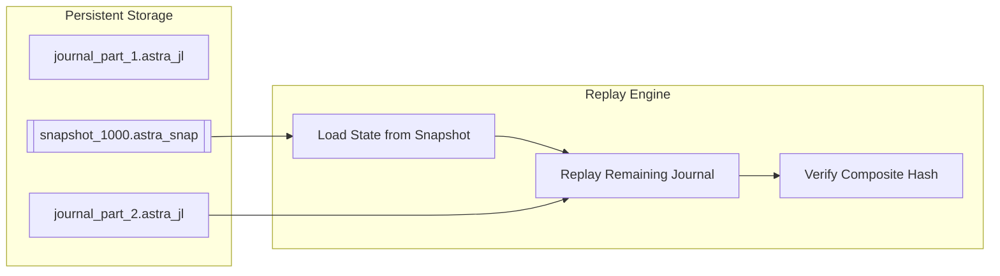

# AstraQuant OS Architecture

AstraQuant OS is a deterministic quantitative systems research platform. The architecture is explicitly split between a non-deterministic, wall-clock aware "Quarantine Layer" (`astra-ops`) and a purely deterministic state machine (`astra-core`).

## Core Architecture Principles

1. **Absolute Determinism**: The core state machine (`AstraKernel`) executes transactions without any awareness of wall-clock time, networking, or threads.
2. **Event-Sourced Truth**: State is entirely a derivative of an ordered, append-only journal of events. If it is not in the journal, it did not happen.
3. **Fail-Closed Replay**: The system cryptographically hashes the application state at the end of every epoch. Replays that do not match the expected state hash perfectly will immediately panic and halt the system.

---

## 1. High-Level Subsystems

```mermaid
flowchart TD
  subgraph astra-ops [astra-ops (Quarantine Layer)]
    Network[External Network / Sockets]
    Telemetry[Prometheus Metrics]
    Daemon[AstraDaemon]
    Audit[Audit Engine]
  end

  subgraph astra-core [astra-core (Deterministic Sandbox)]
    Gateway[ExecutionGateway]
    Journal[(EventJournal .astra_jl)]
    Kernel[AstraKernel]
    
    subgraph strategy [Strategy & Exchange Runtime]
      ER[ExchangeRuntime]
      SR[StrategyRuntime]
      ME[MatchingEngine]
      Portfolio[Portfolio]
    end
  end

  Network -->|Untrusted Bytes| Daemon
  Daemon -->|Sanitized Commands| Gateway
  Gateway -->|Appends| Journal
  Journal -->|Replays / Feeds| Kernel
  Kernel --> SR
  SR --> ER
  ER --> ME
  ER --> Portfolio
```

### `astra-ops` (Quarantine Layer)
The boundary layer. It interfaces with non-deterministic elements (OS threads, file I/O, WebSockets, system time). It intercepts all external inputs, sanitizes them, and feeds them into the `ExecutionGateway`. 

### `astra-core` (Deterministic Sandbox)
A pure, math-driven execution environment. It contains no async primitives, no networking, and no I/O. It simply processes `AstraEvent` objects and mutates state synchronously.

---

## 2. The Deterministic Event Flow

When a new external message arrives, it goes through a strict normalization and journaling sequence.



---

## 3. Replay and Snapshot Boundaries

To ensure fast boot times and recovery from catastrophic failure without replaying the entire history of the journal, AstraQuant OS supports cryptographic snapshotting.



1. **Snapshots**: Periodic dumps of the fully-materialized `AstraKernel` state, bundled with the `sequence_id` and the `state_hash` of the exact moment it was taken.
2. **Replay Engine**: Rather than starting from `sequence_id` 0, the `ReplayEngine` can inject a snapshot, then sequentially apply the remaining tail of `.astra_jl` files.
3. **Verification**: If the newly derived `state_hash` does not mathematically match the appended records, the system fails-closed to prevent corrupted market participation.
